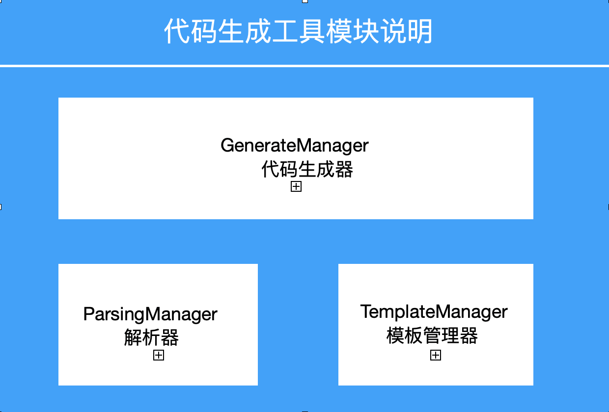

  

本项目是基于模板引擎FreeMarker实现的代码生成工具，主要用于简化平时的编码工作。

## 项目说明

目前我将整个项目划分为三个模块，包括解析器模块，模板管理器模块和代码生成器；

* ParsingManager：用于解析数据源，获得表结构数据，可以通过自定义解析器完成策略的更改；
* TemplateManager：用于获取模板文件，避免重复加载；
* GenerateManager：代码生成逻辑主入口

**代码结构说明**

————config

————————*ParsingManager*（解析器接口）

————————*ParsingJdbcManager*（基于数据源的解析器实现）

————————*ParsingExeclManager*（基于Execl的解析器实现）

————domain

————————*ColumnDomain*（表字段结构说明）

————generate

————————*GenerateManager*（代码生成器）

————template

————————TemplateManager（模板管理器接口）

————————*SimpleTemplateManager*（模板管理器实现）

————utils

————*CodeGenerateApplication*（应用入口）

## 如何起步

### 1.基于数据源

* 在`application.properties`文件内配置数据源
* 判断是否修改模板`template_name`参数和基本包路径`base_package`
* 执行代码生成

## 如何贡献

非常欢迎你的加入！[提一个 Issue](https://github.com/jianjustin/code-generate-tools/issues/new) 或者提交一个 Pull Request。 

## 使用许可

[MIT](LICENSE) © jianjustin

